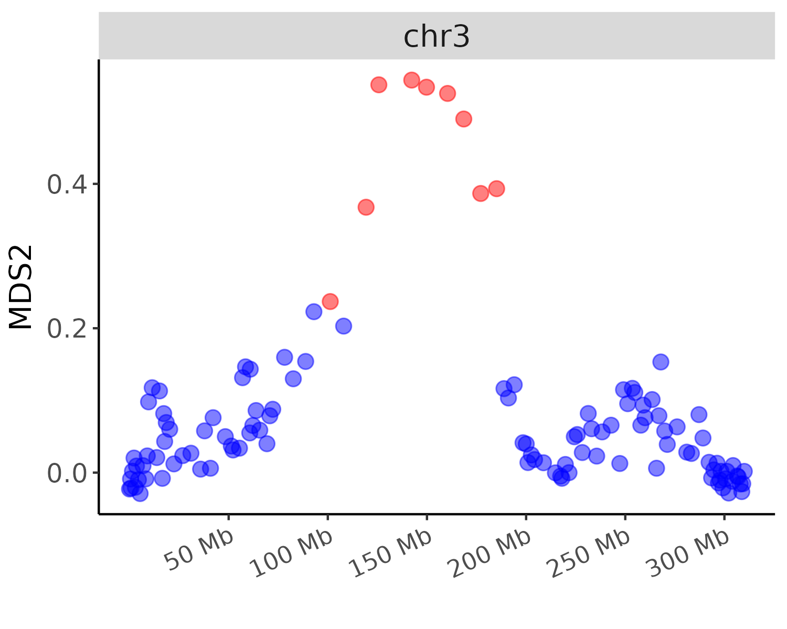
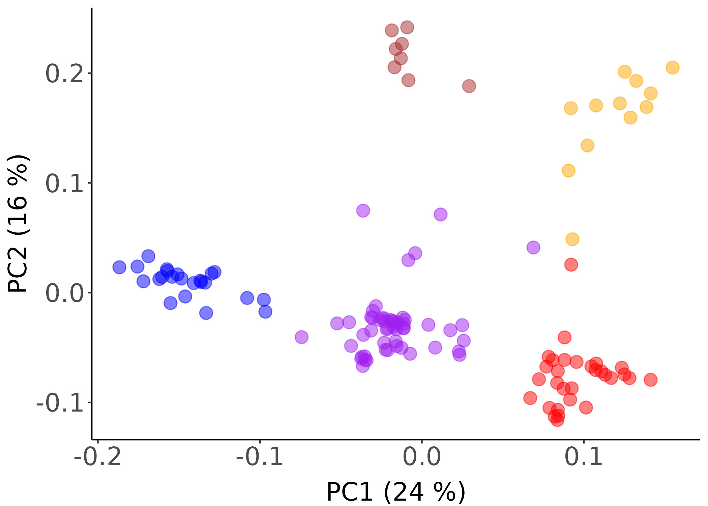
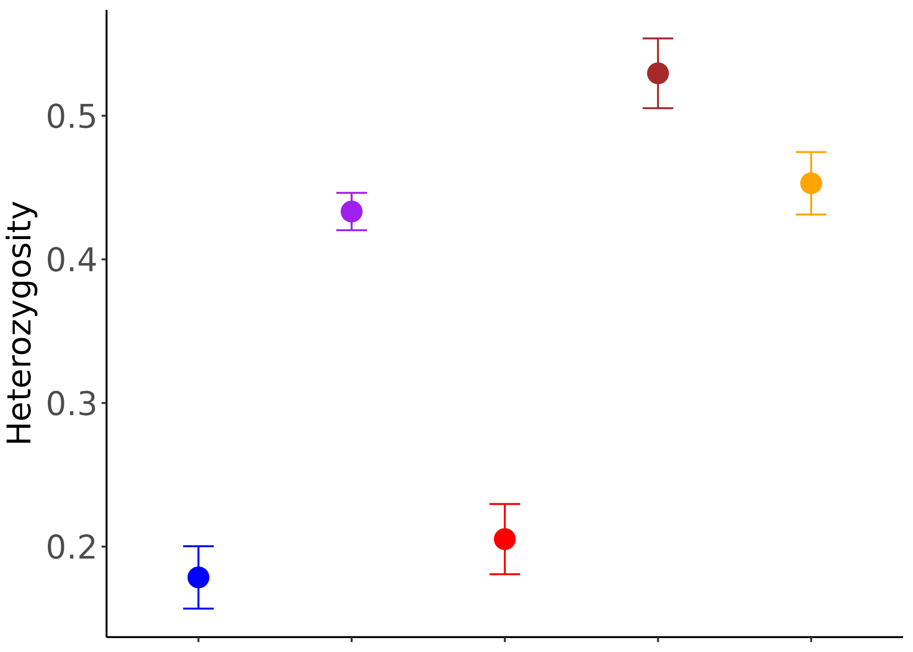
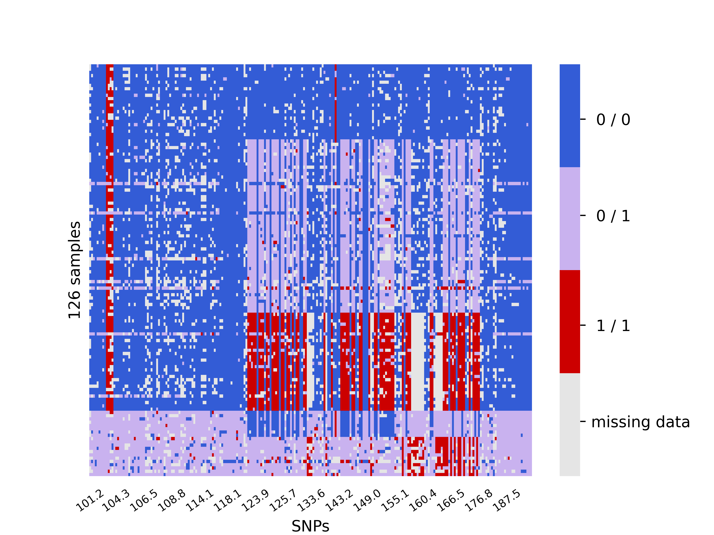
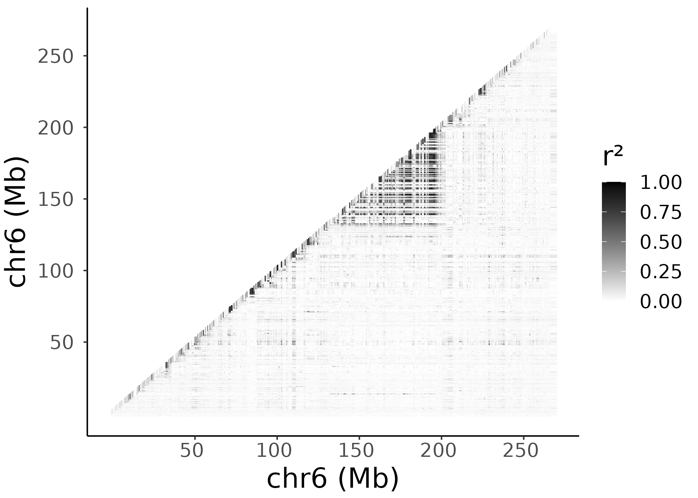
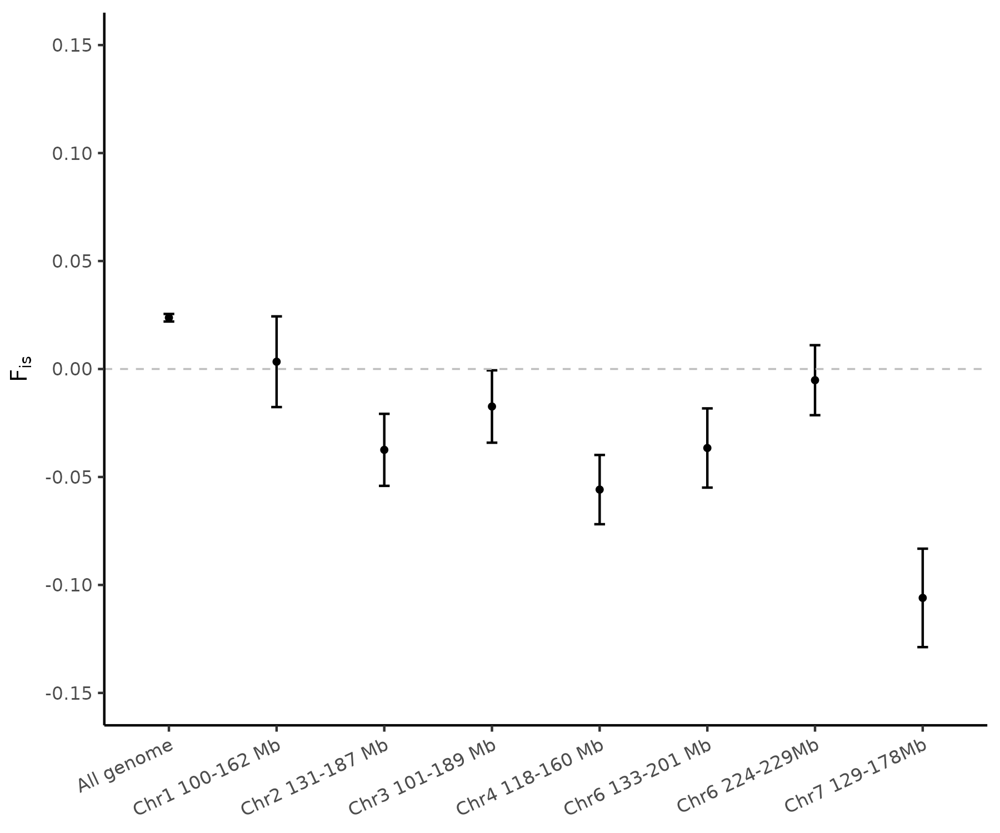
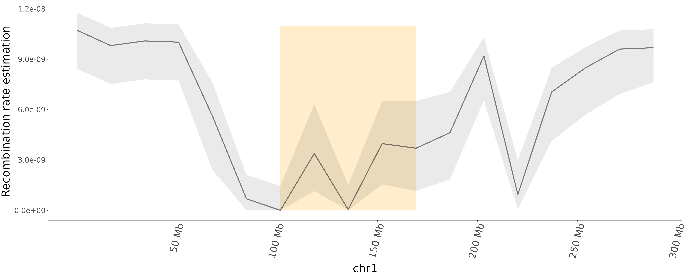
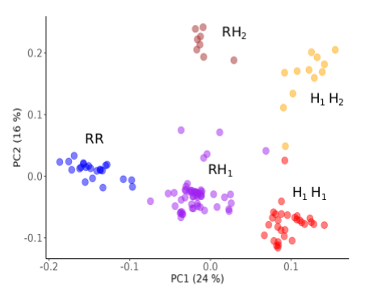

# Low-recombining regions analysis in pearl millet using population genomic approach

This project is made for sharing the analysis and the scripts used for the study _Interplay between large low-recombining regions and pseudo-overdominance in a plant genome_, published here: [Salson 2025](https://www.nature.com/articles/s41467-025-61529-z). In this work, we identified putative structural variants in pearl millet using a population genomic approach ([Mérot 2020](https://doi.org/10.1111/mec.15500)). We then performed analysis to assess if the regions harbored expected hallmarks of pseudo-overdominance ([Gilbert et al. 2020](https://doi.org/10.1016/j.cub.2019.11.063 ), [Waller 2021](https://doi.org/10.1111/evo.14189), [Glémin 2022](https://doi.org/10.24072/pci.evolbiol.100531), [Abu-Wallad & Waller 2023](https://doi.org/10.24072/pcjournal.224)). The analysis performed in the study are listed below:

* [Identification of the candidate regions](#identification-of-the-candidate-regions-using-a-population-genomic-approach)
* [Analysis of the candidate regions](#analysis-of-the-candidate-regions)
* [Visualization of the genotypes](#visualization-of-the-genotypes)
* [LD across the chromosomes](#ld-across-the-chromosomes)
* [Fis across the genome and across the candidate regions](#fis-across-the-genome-and-across-the-candidate-regions)
* [Recombination rate estimation](#recombination-rate-estimation)
* [Fst and Dxy analysis](#fst-and-dxy-analysis)
* [Non synonymous and deleterious mutations](#non-synonymous-and-deleterious-mutations)
* [Genes content within the candidate regions](#genes-content-within-the-candidate-regions)
* [SNPs calling WGS dataset](#snps-calling-wgs-dataset)

The VCF files  with the filtered SNPs of the Senegalese, the temporal, and the African datasets, and the scaffolds of Autof-Pod103sr8 that support the findings of this study are openly available in DataSuds repository (IRD, France) [here](https://doi.org/10.23708/SN2T4A). Data reuse is granted under CC-BY license. 

## Identification of the candidate regions using a population genomic approach

We used the R package [lostruct](https://github.com/petrelharp/local_pca) (v. 0.0.0.9000, [Li & Ralph 2019](https://academic.oup.com/genetics/article/211/1/289/5931130?login=false)) to detect candidate regions across the genome which can putatively harbor large structural variants such as inversions. The approach we used is similar as [Huang et al. 2020](https://doi.org/10.1111/mec.15428).

We first detected and plotted genomic windows with a deviant population structure. The plots and the [script](https://forge.ird.fr/diade/dynadiv/structural_variants_analysis_pearl_millet/-/blob/main/Outlier_genomic_windows/Plot_outlier_genomic_windows.R?ref_type=heads) with brief description of the method can be found [here](https://forge.ird.fr/diade/dynadiv/structural_variants_analysis_pearl_millet/-/tree/main/Outlier_genomic_windows?ref_type=heads). We displayed below the example for chromosome 3. Each point is a genomic window of 100 SNPs. Red windows present a population structure deviant from the rest of the genome.



Based on the identification of these genomic windows with a deviant population structure, we defined candidate regions which can putatively harbor large structural variants such as inversions. 

Candidate regions were defined by clustering of the outlier genomic windows (in red above). The method and the scripts used for clustering and identification of the candidate regions is accessible [here](https://forge.ird.fr/diade/dynadiv/structural_variants_analysis_pearl_millet/-/blob/main/Outlier_genomic_windows/Define_candidate_regions.R). 

The output of the script with the list of the candidate regions can be found [here](https://forge.ird.fr/diade/dynadiv/structural_variants_analysis_pearl_millet/-/blob/main/Outlier_genomic_windows/candidate_regions_spatial_dataset.csv). 

The method has been implemented in a generic and adaptable R package accessible under the Gitlab repository [localPCA](https://forge.ird.fr/diade/dynadiv/inversions_detection_code/-/tree/main/localPCA), and described here: [Huynh et al.]() (to be published). This R package incorporates a last step which consists in concatenating the candidate regions which overlap on the same chromosome (ex: [chr3, MDS2 and MDS5](https://forge.ird.fr/diade/dynadiv/structural_variants_analysis_pearl_millet/-/blob/main/Outlier_genomic_windows/candidate_regions_spatial_dataset.csv)). This step is described in [Huynh et al.]() and allowed to obtain the final list of candidate regions analyzed in the study: 


| Region    | Start |   End   | Size (Mb) | 
| -------- | ------- |  ------- |   ------- |
| Chr1 100-162 Mb  | 99,793,192  |  161,758,608   |   62.0   |
| Chr2 131-187 Mb | 131,088,113   |    186,649,394   |   55.6    |
| Chr3 101-189 Mb | 101,238,580   |    188,834,466   |   87.6    |
| Chr4 118-160 Mb | 118,491,302 |    160,157,576   |   41.7     |
| Chr6 133-201 Mb | 132,717,319   |    201,482,742   |   68.8    |
| Chr6 224-229 Mb | 224,133,144   |    229,409,049   |   5.3    |
| Chr7 129-178 Mb | 128,666,580  |  177,591,959 |   48.6    |

## Analysis of the candidate regions 

The script to perform the additionnal analysis and get the plots for each candidate regions can be found [here](https://forge.ird.fr/diade/dynadiv/structural_variants_analysis_pearl_millet/-/blob/main/analysis_regions/candidate_regions_plots.R). The analysis consists in 1) performing local PCA across [each candidate region](https://forge.ird.fr/diade/dynadiv/structural_variants_analysis_pearl_millet/-/tree/main/analysis_regions/regions), 2) determining the clusters of samples in the population, 3) plotting the mean heterozygosity of the samples per cluster, 4) performing Wilcoxon tests to compare the mean heterozygosity between the clusters of samples.

### Local PCAs and kmean clustering 

The first analysis is the obtention of the population structure across [each candidate region](https://forge.ird.fr/diade/dynadiv/structural_variants_analysis_pearl_millet/-/tree/main/analysis_regions/regions), using the R package SNPRelate (v. 1.30.1). When the population was clearly structured in distinct clusters of samples, we used a kmean clustering approach (Hartigan and Wong 1979) to assign each sample to the different clusters. The number of clusters k used for this apporoach was visually defined. The plots of the population structure for each candidate region can be found [here](https://forge.ird.fr/diade/dynadiv/structural_variants_analysis_pearl_millet/-/tree/main/analysis_regions/img) and we show below the example for chromosome 3. The coloration of samples highlight the different clusters of samples identified in the population. 



### Heterozygosity per cluster

The mean heterozygosity per sample across each candidate region was obtained with VCFtools (v. 0.1.17):

```
vcftools --vcf chrX_XXX_XXXMb.vcf --het --out chrx_XXX_XXMb
```

The output files with the mean heterozygosity per sample across each candidate region are accessible [here](https://forge.ird.fr/diade/dynadiv/structural_variants_analysis_pearl_millet/-/tree/main/analysis_regions/heterozygosity).

The plots with the mean heterozygosity per cluster can be found [here](https://forge.ird.fr/diade/dynadiv/structural_variants_analysis_pearl_millet/-/tree/main/analysis_regions/img) and we show the chromosome 3 as an example:



For each candidate region, we compare the mean heterozygosity between each pair of clusters with Wilcoxon tests (see the script [candidate_regions_plots.R](https://forge.ird.fr/diade/dynadiv/structural_variants_analysis_pearl_millet/-/blob/main/analysis_regions/candidate_regions_plots.R)).


## Visualization of the genotypes

In the study, we visualized the genotypes of the SNPs contributing the most to the local population structure of the candidate region on chromosome 3. The aim was to better identify the haplotypes shaping the population in different clusters of samples.

To do so, we used the script [tables_genotypes.R](https://forge.ird.fr/diade/dynadiv/structural_variants_analysis_pearl_millet/-/blob/main/matrix_of_genotypes/tables_genotypes.R).

The analysis consists first in using the R package [PCAdapt](https://github.com/bcm-uga/pcadapt) (v. 4.3.3), to obtain the list of the SNPs which contribute the most to the local population structure. For this PCAdapt analysis, the VCF file has to be converted in a bed format with plink (v. 1.9) and the following command line:

```
plink --vcf spatial_dataset_chr3_101-189Mb.vcf --make-bed --out spatial_dataset_chr3_101-189Mb_BED
```

We provide [here](https://forge.ird.fr/diade/dynadiv/structural_variants_analysis_pearl_millet/-/tree/main/matrix_of_genotypes/data) the different files generated with plink and required for the PCAdapt analysis. 

We then used the script [generate_tables_of_genotypes.py](https://forge.ird.fr/diade/dynadiv/structural_variants_analysis_pearl_millet/-/blob/main/matrix_of_genotypes/generate_tables_of_genotypes.py) to compute a matrix of the genotypes, with the positions of the SNPs on the x axis, and the samples of the population in the y axis. A VCF file with the samples ordered following the clusters identified in the population (see the section Analysis of the candidate regions: **kmean clustering**) has to be used, and can be found [here](https://forge.ird.fr/diade/dynadiv/structural_variants_analysis_pearl_millet/-/tree/main/matrix_of_genotypes/data).

This allows to obtain the following table of genotypes and to better vizualise the haplotypes shaping the population in distinct clusters of samples:



We perfomed an additionnal analysis which consists in combining the dataset of cultivated Senegalese samples with wild samples from Senegal, Mauritania (Western Africa) and Mali, Niger (Central Africa). The analysis and the scripts used are shared in the Jupyter Notebook [combine_vcf.ipynb](https://forge.ird.fr/diade/dynadiv/structural_variants_analysis_pearl_millet/-/blob/main/combine_datasets/combine_vcf.ipynb?ref_type=heads). 

The aim was to test the hypothesis that the variant region on chr3 found in the cultivated population of Senegal might have been introgressed from wild relatives. The resulting matrix of genotypes is shown below, with first on the y axis the cultivated Senegalese samples and then the wild samples with Western African samples firstly and Central African secondly.  


The hypothesis was statistically further supported by ABBA BABA tests.

## LD across the chromosomes

We calculated the r² between each pair of SNPs across each chromosome. 

To do so, we first reduced the total number of SNPs using VCFtools (v. 0.1.16): 

```
vcftools --vcf spatial_dataset_chrX.vcf --thin 1000 --recode --recode-INFO-all --out spatial_dataset_chrX_thin1000.vcf
```

We then used plink (v. 1.9) with the following command line for each chromosome separately:

```
plink --vcf spatial_dataset_chrX_thin1000.vcf --r2 –ld-window-r2 0.0 --ld-window-kb 310000000 --ld-window 1000000 --out spatial_dataset_chrX_thin1000_plink.ld
```

The corresponding result files are all accessible [here](https://forge.ird.fr/diade/dynadiv/structural_variants_analysis_pearl_millet/-/tree/main/LD/r2_chr?ref_type=heads). We then plotted the r² values of the pair of SNPs for each chromosome with the script which can be found [here](https://forge.ird.fr/diade/dynadiv/structural_variants_analysis_pearl_millet/-/blob/main/LD/LD_plots.R?ref_type=heads). The plots for all chromosomes are accessible [here](https://forge.ird.fr/diade/dynadiv/structural_variants_analysis_pearl_millet/-/tree/main/LD/img) and we presented the example of chromosome 6:



## Fis across the genome and across the candidate regions

To obtain the Fis, we first computed for each locus the observed number of heterozygotes (_Ho_) and the corresponding expected number (_He_) under Hardy-Weinberg equilibrium, using VCFtools (v.0.1.17) with the following command line:

```
vcftools --vcf spatial_dataset_126_samples.vcf --hardy
```

The result output file is accessible [here](https://forge.ird.fr/diade/dynadiv/structural_variants_analysis_pearl_millet/-/blob/main/Fis/spatial_dataset_126_samples.vcf.hwe). We then used the python script [Fis.py](https://forge.ird.fr/diade/dynadiv/structural_variants_analysis_pearl_millet/-/blob/main/Fis/Fis.py?ref_type=heads) to parse the result file and calculate the inbreeding coefficient Fis for each SNP as follows: _(He-Ho)/He_. 

Then, we used the script accessible [here](https://forge.ird.fr/diade/dynadiv/structural_variants_analysis_pearl_millet/-/blob/main/Fis/Plot_Fis.R?ref_type=heads) to obtain the mean Fis across the candidate regions and across the genome excluding the candidate regions. We compared the mean Fis across the regions with the rest of the genome with Wilcoxon tests. 

We showed below the plot of the mean Fis across the genome and across each candidate region.



## Recombination rate estimation 

We used [ReLERNN](https://github.com/kr-colab/ReLERNN) (v. 1.0.0, [Adrion et al. 2020](https://doi.org/10.1093/molbev/msaa038)) to obtain an estimation of the recombination rate across the genome. The command lines used can be found [here](https://forge.ird.fr/diade/dynadiv/structural_variants_analysis_pearl_millet/-/blob/main/recombination_rate_estimation/relernn.sh?ref_type=heads). The output file with the recombination rate estimated within non-overlapping windows is also accessible [here](https://forge.ird.fr/diade/dynadiv/structural_variants_analysis_pearl_millet/-/blob/main/recombination_rate_estimation/relernn_output/spatial_dataset_relernn.PREDICT.BSCORRECTED.txt?ref_type=heads). The script to obtain the plots of the estimated recombination rate across the chromosomes and compare the candidate regions with the rest of the genome using Wilcoxon tests is accessible [here](https://forge.ird.fr/diade/dynadiv/structural_variants_analysis_pearl_millet/-/blob/main/recombination_rate_estimation/recombination_rate_plots.R?ref_type=heads). 

We displayed below an example of the plot obtained for chromosome 1, and the plots of the other chromosomes are shared [here](https://forge.ird.fr/diade/dynadiv/structural_variants_analysis_pearl_millet/-/tree/main/recombination_rate_estimation/img). The candidate region is highlighted in orange.



## Fst and Dxy analysis 

We computed Fst and Dxy statistics using pixy (v. 1.2.10.beta2, [Korunes et al. 2021](https://doi.org/10.1111/1755-0998.13326)) for non-overlapping genomic windows of 100kb, between the pairs of clusters A (RR, see figure below), B (RH1), C (H1H1), D (RH2) and E (H1H2) found on the candidate region of chromosome 3. 



## Non synonymous and deleterious mutations

The VCF file with the SNPs annotated with [SnpEff](http://pcingola.github.io/SnpEff/) (v. 5.1d, [Cingolani 2012](https://doi.org/10.4161/fly.19695)) can be found [here](https://dataverse.ird.fr/dataverse/dynadiv). We used this VCF file to obtain the ratio of non-synonymous to synonymous variants across the genome and across each candidate regions using the jupyter-book [SnpEff_ratio.ipynb](https://forge.ird.fr/diade/dynadiv/structural_variants_analysis_pearl_millet/-/blob/main/non_synonymous_synonymous_variants/SnpEff_ratio.ipynb?ref_type=heads).

We also used [SIFT](https://github.com/rvaser/sift4g) ([Vaser et al. 2016](https://doi.org/10.1038/nprot.2015.123)) to predict the effects of the mutations on protein functions. The SNPs are annotated as tolerated or deleterious. The file with the effects of the mutations can be found [here](https://forge.ird.fr/diade/dynadiv/structural_variants_analysis_pearl_millet/-/blob/main/deleterious_tolerated_variants/pearl_millet_SIFTannotations.csv?ref_type=heads). We used the script accessible [here](https://forge.ird.fr/diade/dynadiv/structural_variants_analysis_pearl_millet/-/blob/main/deleterious_tolerated_variants/SIFT_ratio.ipynb?ref_type=heads) to calclute the ratio of deleterious to tolerated mutations across the genome and the candidate regions.

## Genes content within the candidate regions

We extracted the [ID of the genes found within the candidate regions](https://forge.ird.fr/diade/dynadiv/structural_variants_analysis_pearl_millet/-/tree/main/genes_content) with the Jupyter Notebook [genes_content_analysis.ipynb](https://forge.ird.fr/diade/dynadiv/structural_variants_analysis_pearl_millet/-/blob/main/genes_content/genes_content_analysis.ipynb) and using the GFF file of the pearl millet genome deposited in ENA with the accession [ERZ15184682](https://www.ebi.ac.uk/ena/browser/view/ERZ15184682). The script also allows to extract the sequences of the genes.

In the study, we performed assembly using [optical maps](https://forge.ird.fr/diade/dynadiv/structural_variants_analysis_pearl_millet/-/blob/main/Optical_maps_stats/CMAP_stats.ipynb) and [ONT long reads](https://www.ebi.ac.uk/ena/browser/view/ERR12178246) for a sample, Autof-Pod103sr8, carrying two divergent haplotypes on the chromosome 3 candidate region. We identified the ID of the genes found within the scaffolds of Autof-Pod103sr8 and which covered the candidate region of chromosome 3 with the script [count_genes_on_scaffolds_Autof-Pod103sr8_candidate_regions.ipynb](https://forge.ird.fr/diade/dynadiv/structural_variants_analysis_pearl_millet/-/blob/main/genes_content/count_genes_on_scaffolds_Autof-Pod103sr8_candidate_regions.ipynb). To do so, we performed a transfer of annotation to the scaffolds of Autof-Pod103sr8 using Liftoff (v1.6.3, -copies -sc 0.5, [Shumate & Salzberg 2021](https://doi.org/10.1093/bioinformatics/btaa1016)) and 38,579 gene models from a previous annotation of the pearl millet reference genome available [here](http://gigadb.org/dataset/view/id/100192/File_page/2). The GFF file of the scaffolds of Autof-Pod103sr8 is accesible [here]() (waiting for ENA or datasud submission). Five scaffolds (Super-Scaffold_100015, Super-Scaffold_100020, Super-Scaffold_100024, Super-Scaffold_100003 and Super-Scaffold_100001) cover the candidate region of chromosome 3.

## SNPs calling WGS dataset

Home-made scripts were used for SNPs calling with the WGS dataset and for identifying genotypes of an outgroup of pearl millet. We shared the command lines and python scripts used to:

1. **Perform SNPs calling with the WGS dataset.** We mapped the Illumina short reads of the WGS dataset to the scaffolds of a [new pearl millet genome](https://doi.org/10.1093/g3journal/jkad051). The bash scripts can be found [here](https://forge.ird.fr/diade/dynadiv/structural_variants_analysis_pearl_millet/-/tree/main/SNP_calling_WGS/bash_scripts_snps_calling). A similar approach with the same tools and command lines was used for SNPs calling of both the spatial and the temporal datasets: for these two datasets, the reads were mapped directly to the chromosomes, as the assembly was peer-reviewed and validated at the time we performed the analysis.

2. **Transfer the positions of the SNPs from the scaffolds to the chromosomes.** The scripts are accessible in the [transfert_SNPs_to_chr](https://forge.ird.fr/diade/dynadiv/structural_variants_analysis_pearl_millet/-/tree/main/SNP_calling_WGS/transfert_SNPs_to_chr) directory.

We mapped the Illumina short reads of the WGS dataset to the scaffolds of a [new pearl millet genome](https://doi.org/10.1093/g3journal/jkad051). To obtain the positions of the SNPs to the chromosomes, we used the script [snps_from_scaffolds_to_chr.py](https://forge.ird.fr/diade/dynadiv/structural_variants_analysis_pearl_millet/-/blob/main/SNP_calling_WGS/transfert_SNPs_to_chr/snps_from_scaffolds_to_chr.py). The file with the position and orientation of the scaffolds within each chromosome is accesible [here](https://forge.ird.fr/diade/dynadiv/structural_variants_analysis_pearl_millet/-/blob/main/SNP_calling_WGS/transfert_SNPs_to_chr/scaffolds_within_chromosomes.csv) and further detail of the assembly can be found [here](https://doi.org/10.1093/g3journal/jkad051). 

For validation, we checked if the REF alleles of the SNPs were the same nucleotide as expected at the position of the sequences of the chromosomes. We also used the 76,018 SNPs of the VCF file of the spatial dataset for which the mapping of the reads was made directly to the chromosomes of the new pearl millet genome. For each of the SNPs found at the same position, we checked if the REF and ALT alleles were the same: it was 100% correct. 


3. **Identify the genotypes of the outgroup of pearl millet.** The different scripts are provided in the [SNPs_outgroup](https://forge.ird.fr/diade/dynadiv/structural_variants_analysis_pearl_millet/-/tree/main/SNP_calling_WGS/SNPs_outgroup) directory.

We used Illumina short reads of two _Cenchrus pedicellatus_ individuals (accessions: [srx4310736](https://www.ncbi.nlm.nih.gov/sra/?term=srx4310736) and [srx4310737](https://www.ncbi.nlm.nih.gov/sra/?term=srx4310737)), an outgroup in the same genus of pearl millet. Reads were cleaned using Cutadapt (v. 3.1, Marcel M. 2011, -m 35 -q 20 -b -B parameters) and mapped to a [new pearl millet genome](https://doi.org/10.1093/g3journal/jkad051) using bwa mem2 (v. 2.2.1, default parameters, Li and Durbin 2009, Vasimuddin et al. 2019). We used the HaplotypeCaller module of the Genome Analysis Toolkit (v. 4.2.3.0, --output-mode EMIT_ALL_ACTIVE_SITES -ERC BP_RESOLUTION parameters, McKenna et al 2010) to call variants and determine the genotypes of each individual. We only kept the genotypes which were similar for the two individuals and with a cumulative DP >=2 and GQ>0. 


